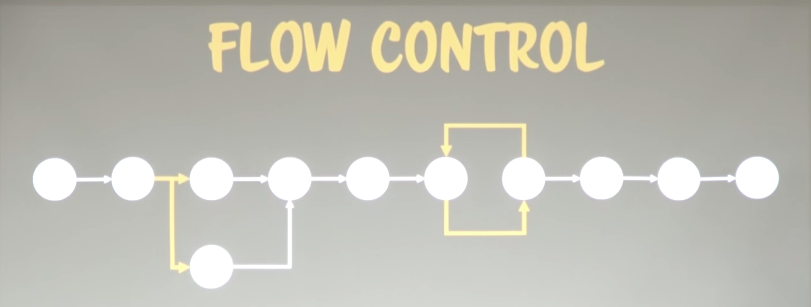
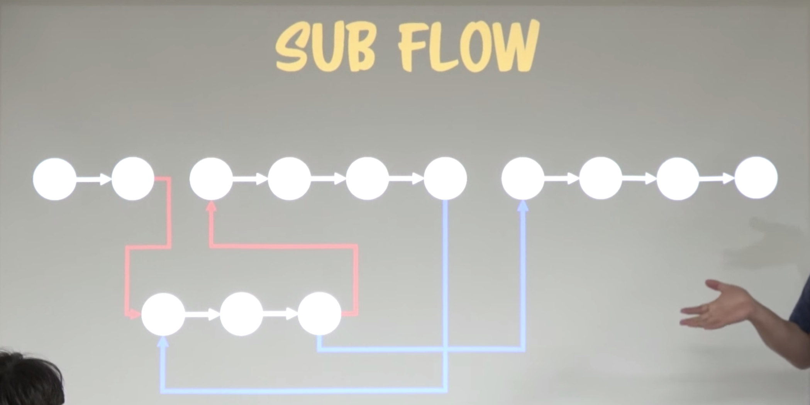

## 1) EXPRESSIONS
**식 == 값**
 식은 코드의 조각들이고 하나의 값으로 도출 된다. 원하는 만큼 길게 작성 할 수 있지만 결국 하나의 값이다. 값을 여러가지 방법으로 표현하는 것이 식이다. 식은 문처럼 활용할 수 있지만 문은 식처럼 쓸 수 없다. 
 
- 값식 : 값자체가 식이다.
- 연산식 : 연산자와 결합하는 식이다.
- 선언식 : JS에서 함수호출을 하면 undefined든 무엇이든 값이 도출 된다.

## 2) STATEMENTS
 기본적으로 문은 행동을 수행하고 행동한다. 그리고 컴파일러와 실행기가 문을 받으면서 힌트로 여긴다. 이어서 어떻게 실행할지를 생각하고 메모리에 남기지 않고 처리만 한다. 
- 공문 : JS는 공문(비문)을 인정한다. 
```JS
for(var i = 0; i < 5; i++);
-> undefined
-----------------------------
;;;;;;;;;;
-> undefined
```
- 선언문 (var, let, const) : 선언을 목적으로 만들어진 문으로써 **메모리 상의 변수를 할당**하는 일. 할당되면서 Vtable에도 동시에 작성 된다.
  (틈새지식 -  변수란 ? 메모리 주소의 별명, 타입, 크기) —> 엘리어스되었다.
- 식문 : 하나의 식을 문으로 인정한다. ";" 을 줄 끝에 추가하거나 자동삽입해서 표현식을 문으로 변환할 수 있다.
- 제어문 : Flow(흐름)를 제어하는 것이다.

  프로그램의 실체는 메모리에 적재되어 있는 명령어들의 연쇄다.  CPU는 명령어들을 차례로 소비하며 종료 할때까지 실행시킨다.
  -Sync Flow : 기본적인 프로그램의 흐름
  -Flow Control : 동기적 흐름을 제어 할 수 있다면 
  
  -Sub Flow : 흐름을 반복적으로 사용하기도 한다. (제어문이 아니라 함수나 클래스를 이용하여 제어한다.)
  
- 단문, 중문 
  : 단문이 들어갈 자리에 두개 이상의 문을 중괄호로 묶는 다면 넣을 수 있다. 중문이 올 자리에 단문이 올 수 있고 단문이 올 자리에 중문이 올 수 있다.
```js
  if (true);
  -> undefined
  if (true);;
  -> undefined
  if (true){;;}
  -> undefined
  ---------------------------
   if(true) a=3; else {if(a>2)b=3; else b=5;}
  단문을 중괄호로 묶어서 중문으로 쓸때는 끝에 ; 을 붙이지 않는다. 붙일 경우 공문을 하나 더 삽입시키는 것이다.
```
### These are all javascript statements:
1. if
2. if-else
3. while
4. do-while
5. for
6. switch
7. for-in
8. with (deprecated)
9. debugger
10. variable declaration
